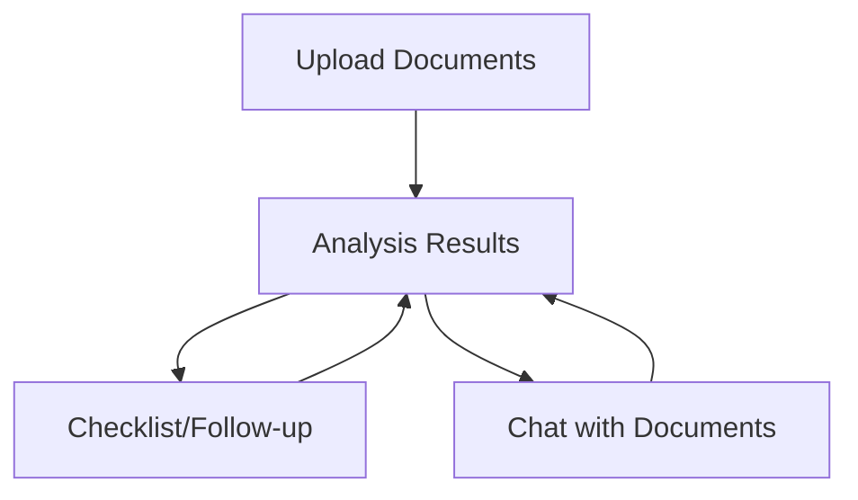

# Legal OS - M&A Diligence Module (AIE8 Challenge) UI/UX Specification

**Document Owner:** Sally, UX Expert 🎨
**Status:** Approved
**Next Step:** Handoff to Architect (Winston)

## 1. Introduction

### 1.1 Overall UX Goals & Principles

* **Target User Personas:**
    * **Primary:** M&A Legal Professionals (e.g., Mid-size law firms, In-house counsel) - Need efficiency, accuracy, and trustworthiness.
    * **Implicit:** Evaluators (Certification Challenge) - Need clarity and demonstration of requirements.
* [cite_start]**Usability Goals:** [cite: 682-683]
    * **Clarity:** Instantly understandable interface, especially regarding analysis results and provenance.
    * **Efficiency:** Smooth workflow for uploading documents, initiating analysis, viewing results, and using the chat.
    * **Trustworthiness:** Professional design and clear provenance linking build confidence in the AI's output.
    * **Modern Aesthetic:** Visually impressive interface reflecting the cutting-edge AI backend (Harvey AI inspired).
* [cite_start]**Design Principles:** [cite: 684-685]
    1.  **Clarity First:** Prioritize clear information hierarchy and understandable presentation of complex legal data.
    2.  **Efficiency Focused:** Streamline the core workflow (Upload -> Analyze -> Review -> Chat).
    3.  **Trust Through Transparency:** Make provenance links highly visible and easy to use.
    4.  **Modern Professionalism:** Maintain a clean, sophisticated, and minimalist aesthetic.
    5.  **Accessibility (WCAG AA):** Ensure the design is usable by individuals with disabilities.

### 1.2 Change Log

| Date   | Version | Description              | Author     |
| :----- | :------ | :----------------------- | :--------- |
| (Auto) | 1.0     | Initial Draft            | Sally (UX) |
| (Auto) | 1.1     | Specified Light Theme Only | Sally (UX) |
| (Auto) | 1.2     | Simplified Acc. Testing  | Sally (UX) |

---

## 2. Information Architecture (IA)

### 2.1 Site Map / Screen Inventory


* **Upload Documents:** Entry point for new analysis.
* **Analysis Results:** Main hub displaying summary, risks, provenance.
* **Checklist/Follow-up:** View accessible from Results.
* **Chat with Documents:** View accessible from Results.

### 2.2 Navigation Structure

* **Primary Navigation:** Simple navigation likely via tabs or links within the "Analysis Results" view to switch between Results, Checklist, and Chat. A "Start New Analysis" action returns to Upload.
* **Secondary Navigation:** N/A.
* **Breadcrumb Strategy:** N/A.

---

## 3. User Flows

### 3.1 Flow 1: Document Upload & Analysis Initiation

* **User Goal:** Upload documents and start analysis.
* **Entry Points:** Initial application load.
* **Success Criteria:** Documents uploaded, analysis begins, user gets feedback.
* **Flow Diagram:**
    ```mermaid
    graph TD
        A[Start on Upload Screen] --> B{Select/Drag Files};
        B --> C[Display Selected Files];
        C --> D[User Clicks 'Start Analysis'];
        D --> E[Show Processing Indicator];
        E --> F[Navigate to Results Screen (when ready)];
    ```
* **Edge Cases:** Invalid file type, upload failure, start with no files.

### 3.2 Flow 2: Viewing Analysis Results & Provenance

* **User Goal:** Review summary, risks, verify via provenance.
* **Entry Points:** Post-analysis navigation.
* **Success Criteria:** User reads summary, understands risks, clicks provenance links.
* **Flow Diagram:**
    ```mermaid
    graph TD
        A[Arrive on Results Screen] --> B[View Summary Report];
        B --> C{See Flagged Risk?};
        C -->|Yes| D[Review Risk Details];
        C -->|No| E[Continue Reading];
        D --> E;
        E --> F{See Provenance Link?};
        F -->|Yes| G[Click Provenance Link];
        G --> H[Display Source Text Snippet/Location];
        H --> E;
        F -->|No| I[End Review];
    ```
* **Edge Cases:** Analysis failed, broken provenance link.

### 3.3 Flow 3: Accessing Checklist/Follow-up

* **User Goal:** View generated checklist.
* **Entry Points:** Link/Tab on Results Screen.
* **Success Criteria:** User accesses and reads checklist.
* **Flow Diagram:**
    ```mermaid
    graph TD
        A[On Results Screen] --> B[Click 'View Checklist' Link/Tab];
        B --> C[Display Checklist Screen];
        C --> D[User Reviews Items];
        D --> E[Navigate Back to Results (Optional)];
    ```
* **Edge Cases:** Checklist generation failed.

### 3.4 Flow 4: Chatting with Documents

* **User Goal:** Ask questions about documents.
* **Entry Points:** Link/Tab on Results Screen.
* **Success Criteria:** User asks question, receives relevant answer with potential provenance.
* **Flow Diagram:**
    ```mermaid
    graph TD
        A[On Results Screen] --> B[Navigate to Chat Screen];
        B --> C[User Types Question in Input];
        C --> D[User Submits Question];
        D --> E[Show Thinking/Processing Indicator];
        E --> F[Display AI Response];
        F --> C;
    ```
* **Edge Cases:** Chat backend failure, AI cannot answer, network error.

---

## 4. Wireframes & Mockups (Conceptual)

### 4.1 Design Files Reference
* **Primary Design Files:** *User/Team to provide link if created externally.* Detailed mockups should be created in Figma/Sketch.

### 4.2 Key Screen Layouts (Conceptual)

1.  **Screen: Document Upload**
    * **Layout:** Minimalist, large central drag-and-drop zone, Browse button.
    * **Elements:** Drop Zone, Browse Button, Selected Files List, "Start Analysis" Button.
    * **Aesthetic:** Spacious, intuitive.
2.  **Screen: Analysis Results**
    * **Layout:** Multi-panel (e.g., Main content for summary, Sidebar/Tabs for Risks/Navigation).
    * **Elements:** Formatted Summary, Risk list/cards, Provenance indicators/links, Navigation (to Checklist/Chat), "Start New Analysis" Button.
    * **Aesthetic:** Professional, readable, trustworthy. Clear risk visualization.
3.  **Screen: Checklist/Follow-up**
    * **Layout:** Simple list/card layout.
    * **Elements:** Title, Checklist items, Back navigation.
    * **Aesthetic:** Clean, actionable.
4.  **Screen: Chat with Documents**
    * **Layout:** Standard chat interface.
    * **Elements:** Chat History Panel, Message Input Field, Submit Button, Loading indicator, Back navigation.
    * **Aesthetic:** Modern chat UI, matching Results theme.

---

## 5. Component Library / Design System

### 5.1 Design System Approach
* **Recommendation:** Leverage a **pre-existing, high-quality UI component library** to achieve the ultra-modern aesthetic efficiently.
* **Architect Decision:** Final library selection (e.g., Material UI, Ant Design, Chakra UI, Shadcn/ui) by Architect based on chosen frontend framework and aesthetic goals.

### 5.2 Core Components (Conceptual List)
* **Layout:** Grid, Stack, Container.
* **Input:** File Uploader, Text Input, Buttons.
* **Display:** Cards, Lists, Text/Typography, Provenance Link/Tooltip.
* **Feedback:** Progress Indicators, Alerts, Spinners.
* **Overlay:** Modal (for provenance).
* **Chat:** Chat History, Message Bubbles.

---

## 6. Branding & Style Guide

### 6.1 Visual Identity
* **Aesthetic Goal**: Ultra-modern, clean, minimalist, professional, inspired by Harvey AI.
* **Theme**: **Light Theme only** for this prototype.
* **Brand Guidelines**: N/A.

### 6.2 Color Palette (Conceptual)
* **Primary**: Neutral base (shades of grey, off-white).
* **Accent**: Single clean accent (e.g., modern blue/teal/green) used sparingly.
* **Feedback Colors**: Standard Success (green), Warning (amber), Error (red) with sufficient contrast.
* **Selection**: Final hex codes TBD based on chosen library.

### 6.3 Typography (Conceptual)
* **Font Families**: Clean, modern sans-serif (e.g., Inter, Poppins, system UI).
* **Type Scale**: Clear scale (H1-H6, Body, Small) focused on readability and hierarchy.

### 6.4 Iconography
* **Style**: Clean, minimalist, line-style icons.
* **Library**: Leverage standard library (Material Symbols, Feather, or from UI kit).

### 6.5 Spacing & Layout
* **Grid System**: Standard grid (e.g., 12-column).
* **Spacing Scale**: Consistent scale (e.g., 4px/8px increments), emphasize white space.

---

## 7. Accessibility Requirements

### 7.1 Compliance Target
* **Standard:** **WCAG 2.1 Level AA**.

### 7.2 Key Requirements
* **Visual:** Min. contrast ratios (4.5:1 text, 3:1 large/gfx), visible focus indicators, text resizable to 200%, info not by color alone.
* **Interaction:** Full keyboard operability, screen reader support (Semantic HTML/ARIA), adequate touch targets.
* **Content:** Alt text for meaningful images/icons, proper heading structure, associated form labels, `lang` attribute.

### 7.3 Testing Strategy
* **Primary Strategy:** Rely on the **built-in accessibility features** of the chosen UI component library.
* **Developer Responsibility:** Use components semantically and follow library guidelines.
* **Manual Checks:** Light manual testing for keyboard navigation, focus visibility, and basic contrast during development.

---

## 8. Responsiveness Strategy

### 8.1 Breakpoints

| Breakpoint | Min Width | Target Devices (Conceptual) | Notes                      |
| :--------- | :-------- | :-------------------------- | :------------------------- |
| Mobile     | 320px     | Small Phones                | Basic usability ensured    |
| Tablet     | 768px     | Tablets                     | Clean layout adaptation    |
| Desktop    | 1024px    | Laptops, Desktops           | **Primary target** |
| Wide       | 1440px+   | Large Desktops              | Layout centers or expands  |

### 8.2 Adaptation Patterns

* **Layout:** Use responsive grids; stack vertically on small screens.
* **Navigation:** Collapse to menu if needed; likely simple links.
* **Content Priority:** Ensure core content visible on all sizes.
* **Interaction:** Ensure touch targets sufficient for tablet.

---
